# BlogPlatform

Custom WordPress проект за **Aperture**: мала уредничка блог платформа со frontend пишување, модерирани придонеси и авторски dashboard.

Репото го чува проектниот код што е потребен за да се разбере и продолжи темата: child theme, workflow hooks, локални assets, generated Blocksy CSS што го држи изгледот, пример конфигурација и screenshots од главните екрани.

## Што има во проектот

- `app/public/wp-content/themes/blocksy-child/` - custom child theme со templates, styles, scripts и brand assets за Aperture.
- `app/public/wp-content/mu-plugins/aperture-workflow.php` - workflow слој за plugin bootstrap, frontend submissions, moderation, dashboard податоци и demo content.
- `app/public/wp-content/uploads/blocksy/css/global.css` - generated Blocksy CSS потребен за тековниот layout.
- `app/public/wp-config.example.php` - пример WordPress конфигурација без локални credentials.
- `docs/screenshots/` - визуелен преглед на главните screens.

## Како е врзан кодот

Child theme-от го рендерира јавниот дел на платформата: home, explore, topics, article, auth и contributor screens. Делот што не е чист template е во `aperture-workflow.php`: креирање на потребните pages, demo seed, frontend submit, moderation status, category suggestions и бројки за dashboard.

Posts, categories и users остануваат native WordPress content, за да може платформата да се користи и од admin без посебен CMS слој. Contributor flow-от користи WordPress users/capabilities, а frontend формите само го пакуваат workflow-от во попријателски screens.

## Екрани

Screenshots се од локална WordPress инсталација со Blocksy parent theme и потребните plugins активни.

| Екран | Кратко објаснување |
| --- | --- |
| Home | Почетна страна со editorial hero, повик за читање/пишување и preview од теми и stories. |
| Explore | Каталог за stories со search, category filters и grid од објави. |
| Topics | Преглед на категории, статус на предложени теми и можност за следење/предлагање. |
| Article | Single post template со cover, metadata, reading actions и comments area. |
| Contribute | Logged-in writer view за поднесување essay или предлагање нова категорија. |
| My content | Contributor dashboard за сопствени posts, review status, comments и suggestions. |
| Sign in / Create account | Custom authentication screens за contributor пристап. |
| About / Contributors | Статични project pages за платформата и листа на автори. |
| Mobile home / explore | Responsive преглед за header, hero, search и browsing flow на тесен екран. |

<table>
  <tr>
    <td><strong>Home</strong> 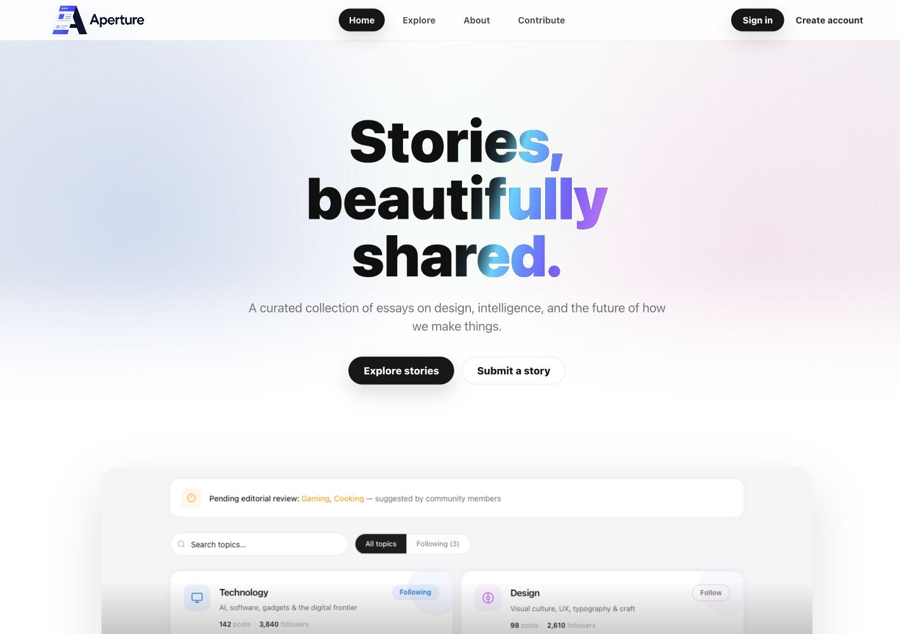</td>
    <td><strong>Explore</strong> 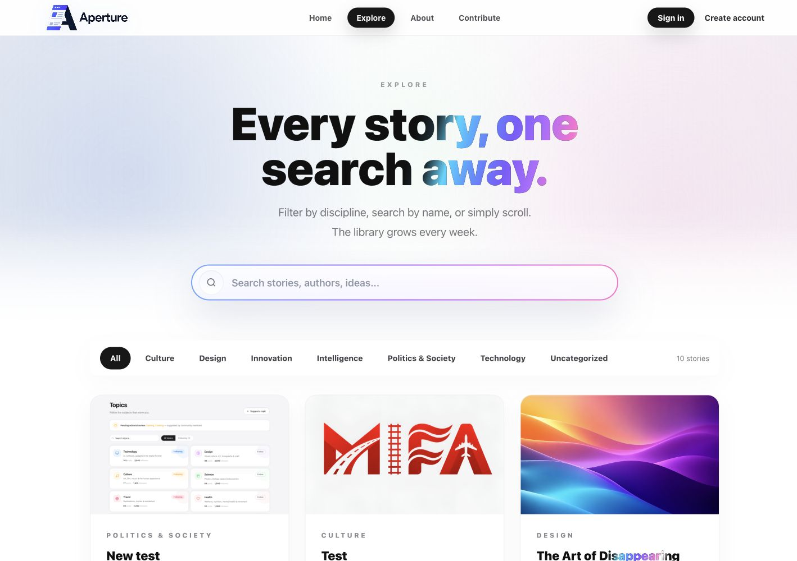</td>
  </tr>
  <tr>
    <td><strong>Topics</strong> 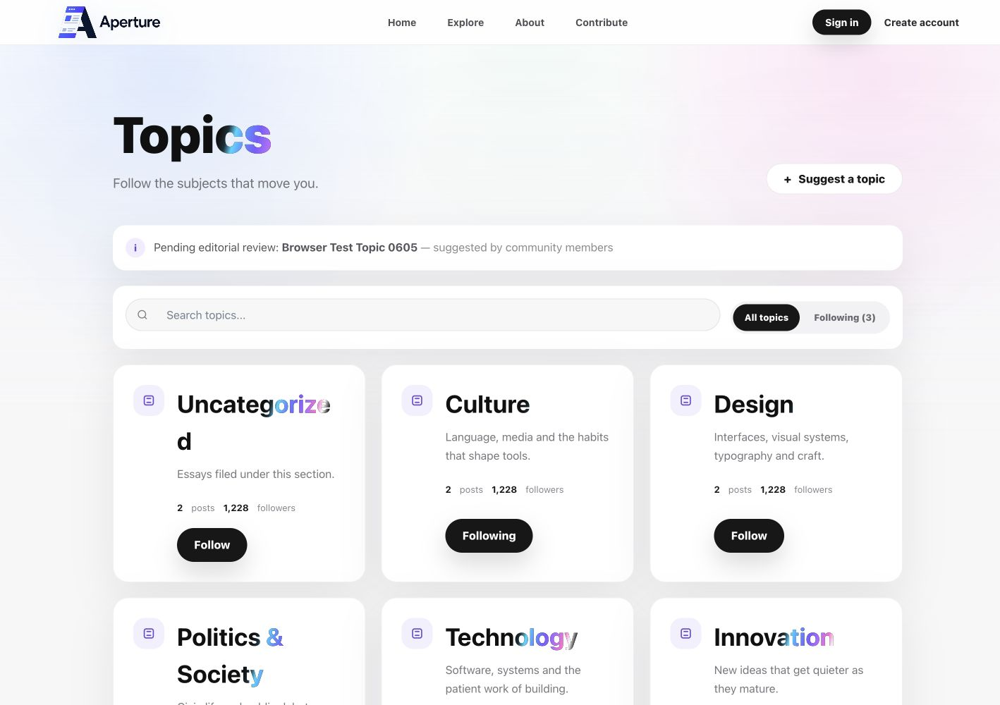</td>
    <td><strong>Article</strong> 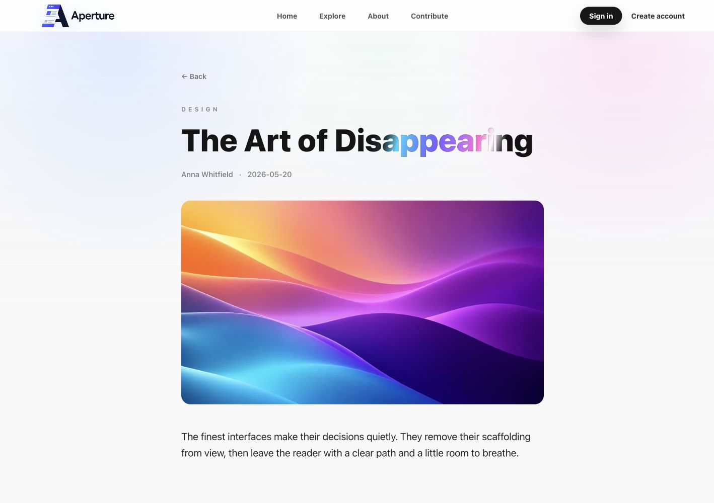</td>
  </tr>
  <tr>
    <td><strong>Contribute</strong> 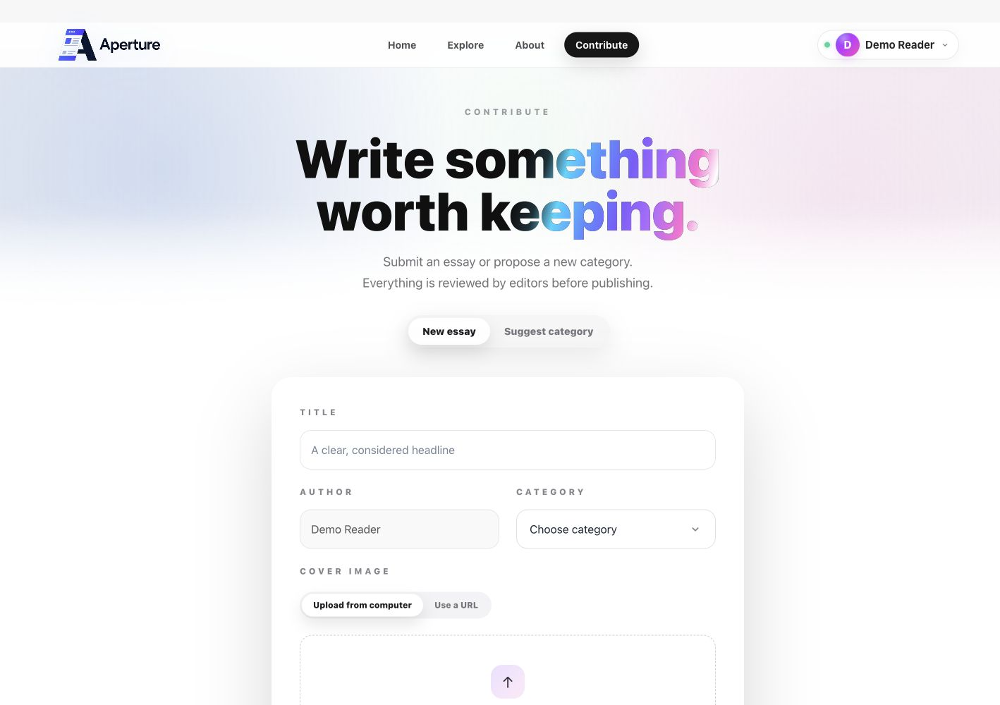</td>
    <td><strong>My content</strong> 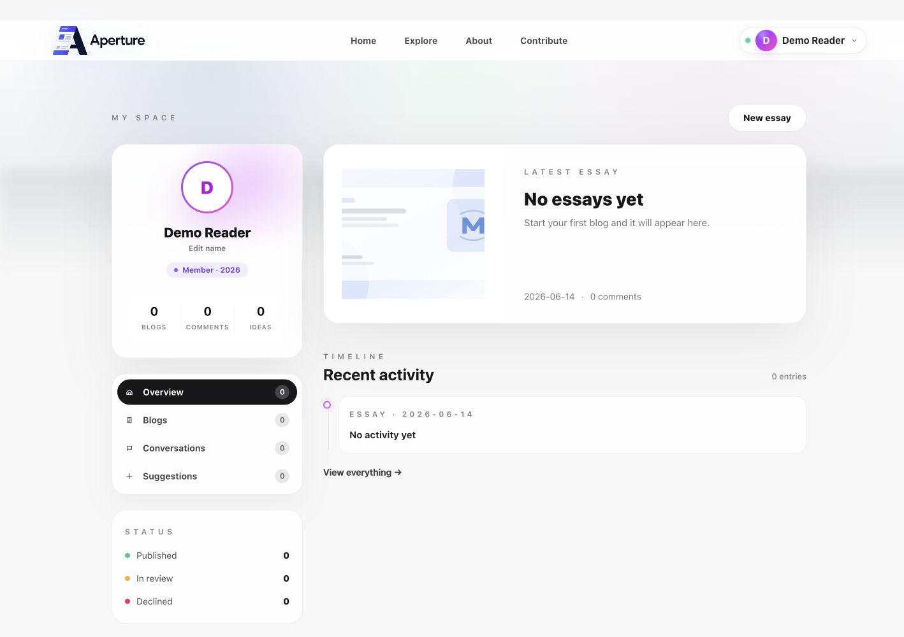</td>
  </tr>
  <tr>
    <td><strong>Sign in</strong> 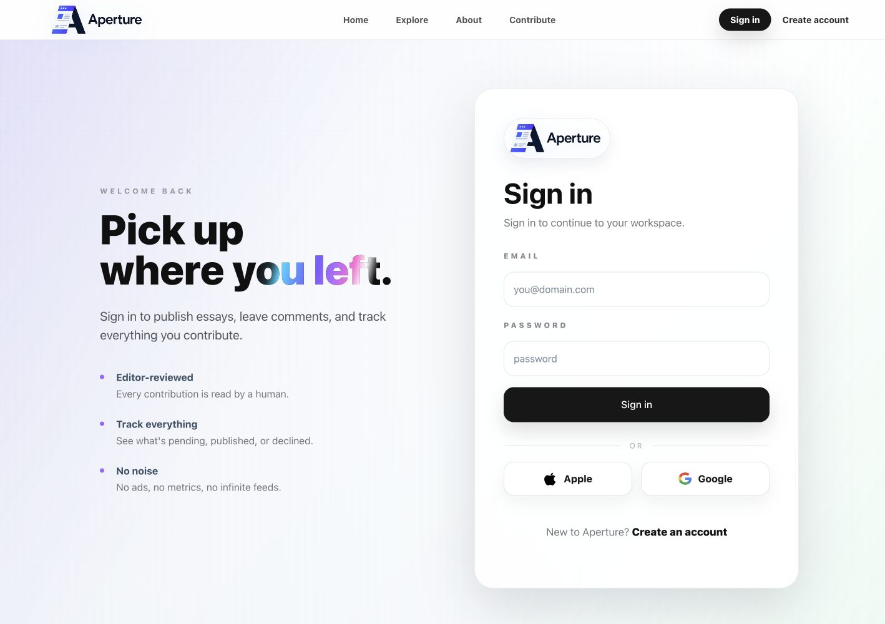</td>
    <td><strong>Create account</strong> 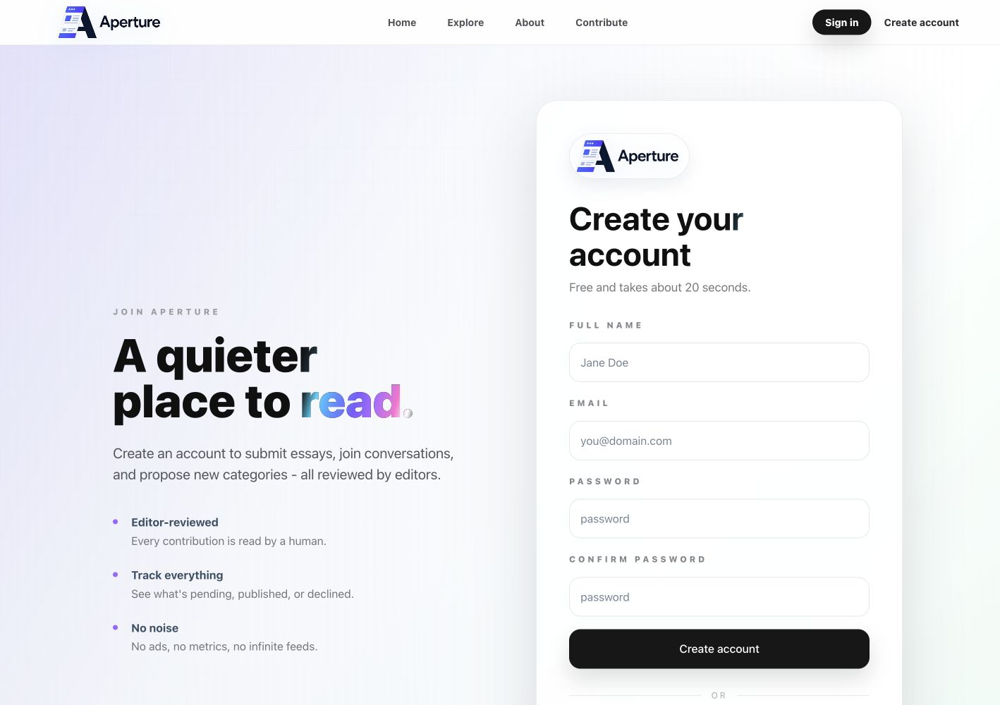</td>
  </tr>
  <tr>
    <td><strong>About</strong> 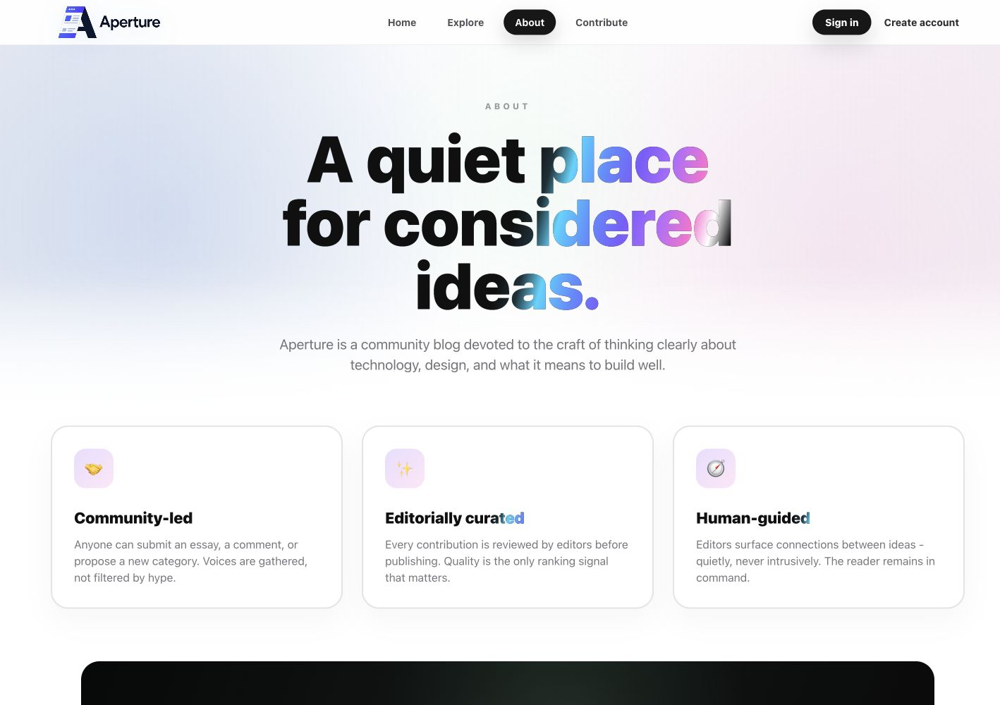</td>
    <td><strong>Contributors</strong> 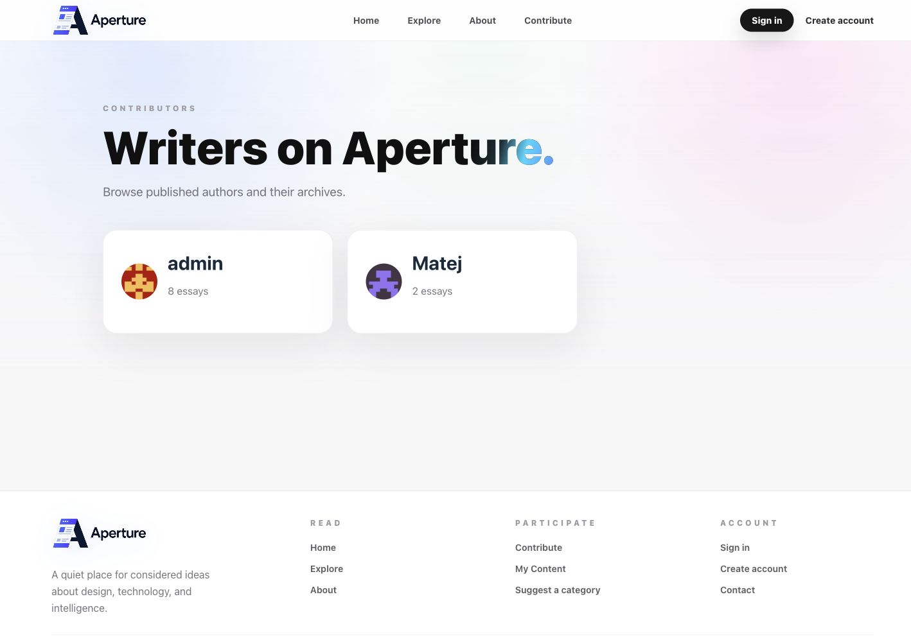</td>
  </tr>
  <tr>
    <td><strong>Mobile home</strong> 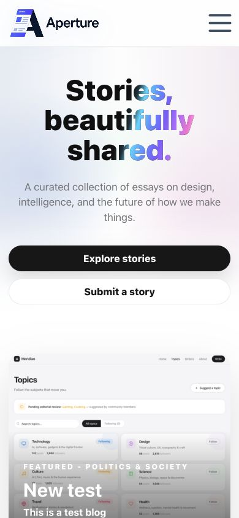</td>
    <td><strong>Mobile explore</strong> 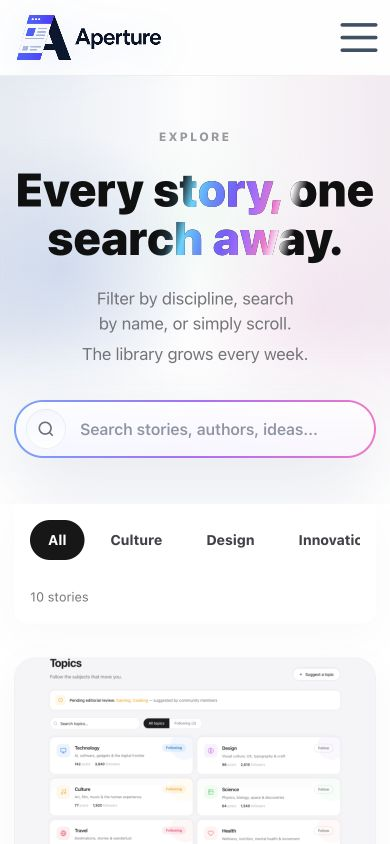</td>
  </tr>
</table>

## Белешки за работа

- `functions.php` ги sync-ира основните pages и menu items кога верзијата на темата се менува.
- Page templates се во `page-templates/`; slug-овите таму се очекувани и од workflow кодот.
- Frontend submit формата креира contributor content што оди во review пред publish.
- Screenshots се дел од документацијата. Ако се менува layout, освежи ги заедно со README.

## Локално пуштање

Проектот е работен во Local WP.

1. Клонирај го репото.
2. Во Local WP креирај или отвори WordPress site за проектот.
3. Постави WordPress core во `app/public/`.
4. Инсталирај го parent theme-от `Blocksy`.
5. Инсталирај ги plugin зависностите од листата подолу.
6. Копирај `app/public/wp-config.example.php` во `app/public/wp-config.php` и внеси локални DB податоци.
7. Импортирај database backup за pages, posts, users и plugin settings.
8. Активирај ја child темата `Aperture - Premium Blog Platform Child`.

## WordPress dependencies

Овие plugins/themes треба да постојат во локалната WordPress околина:

- WordPress core
- Blocksy
- Blocksy Companion
- PublishPress Planner
- PublishPress Capabilities
- WP User Frontend
- WP ULike
- Post Views Counter
- Antispam Bee
- Remove Dashboard Access
